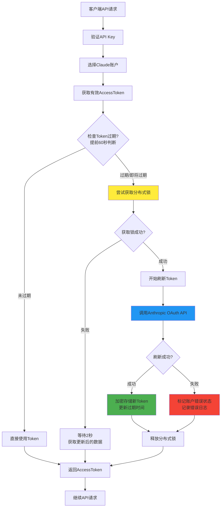
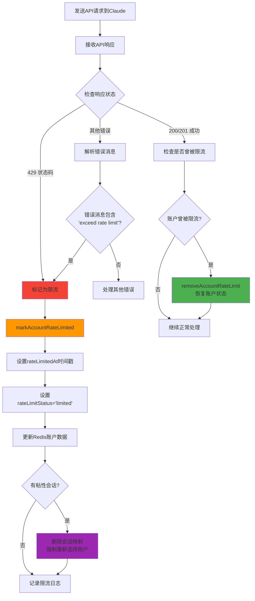
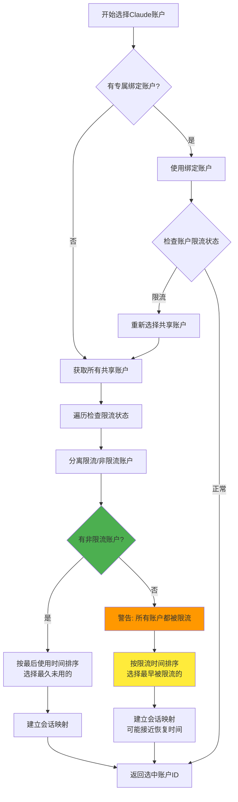
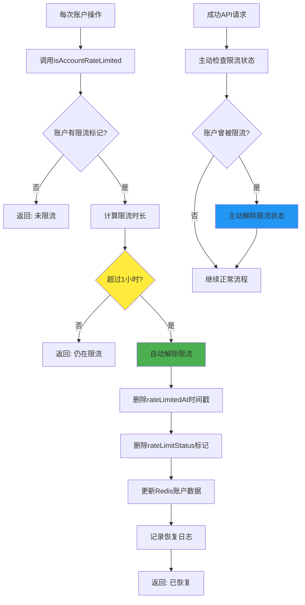
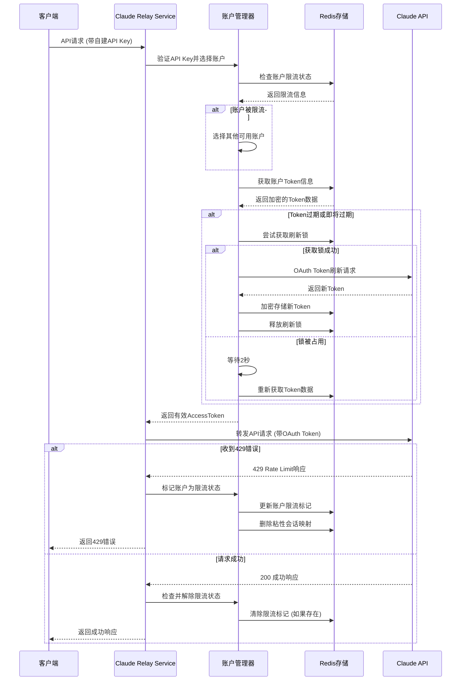

# Claude Token管理和429处理可视化流程

## 🔄 OAuth Token自动刷新机制



## 🚫 429 Rate Limit处理机制



## 🎯 智能账户选择策略



## ⏰ 自动恢复机制



## 📊 完整的请求处理流程



## 🔧 关键配置参数

| 参数 | 值 | 说明 |
|------|-----|------|
| Token提前刷新时间 | 60秒 | 在Token过期前60秒开始刷新 |
| 分布式锁TTL | 60秒 | 防止死锁的超时时间 |
| 限流自动恢复时间 | 1小时 | 被限流后自动恢复的时间 |
| 锁冲突等待时间 | 2秒 | 获取锁失败后的等待时间 |
| OAuth请求超时 | 30秒 | Token刷新请求的超时时间 |
| 会话映射TTL | 1小时 | 粘性会话的过期时间 |

## 🗄️ Redis数据结构

### Claude账户数据
```json
{
  "id": "account-uuid",
  "name": "账户名称",
  "accessToken": "encrypted_access_token",
  "refreshToken": "encrypted_refresh_token", 
  "expiresAt": "1640995200000",
  "rateLimitedAt": "2024-01-15T10:30:00.000Z",
  "rateLimitStatus": "limited",
  "lastUsedAt": "2024-01-15T09:30:00.000Z",
  "lastRefreshAt": "2024-01-15T08:30:00.000Z"
}
```

### 分布式锁
```
Key: token_refresh_lock:claude:account-id
Value: unique-uuid
TTL: 60秒
```

### 粘性会话映射
```
Key: session_mapping:session-hash
Value: account-id
TTL: 3600秒
```

## 📈 监控指标

- **限流账户数量**: 当前被限流的账户总数
- **Token刷新成功率**: 刷新成功/总刷新次数
- **账户切换频率**: 因限流导致的账户切换次数
- **平均恢复时间**: 从限流到自动恢复的平均时间
- **并发刷新冲突**: 分布式锁冲突的次数

这个设计确保了高可用性、自动恢复和智能负载均衡，同时保证了数据安全和系统稳定性。